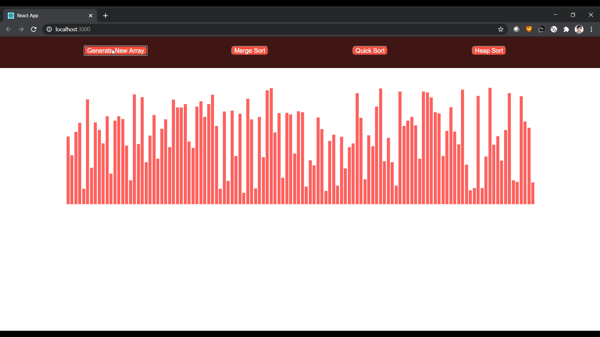
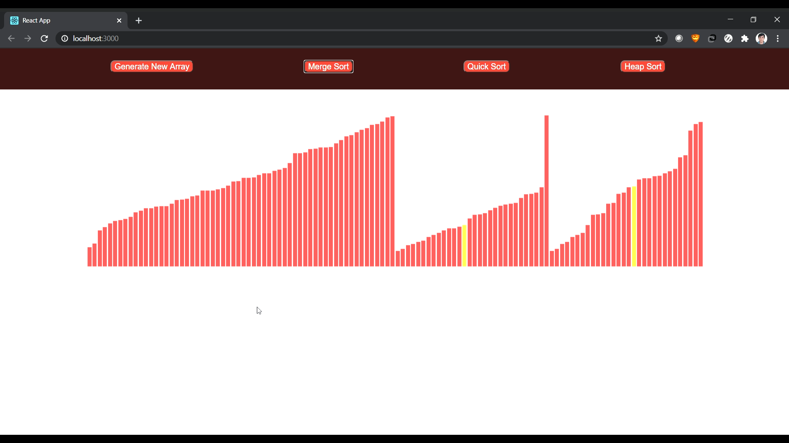
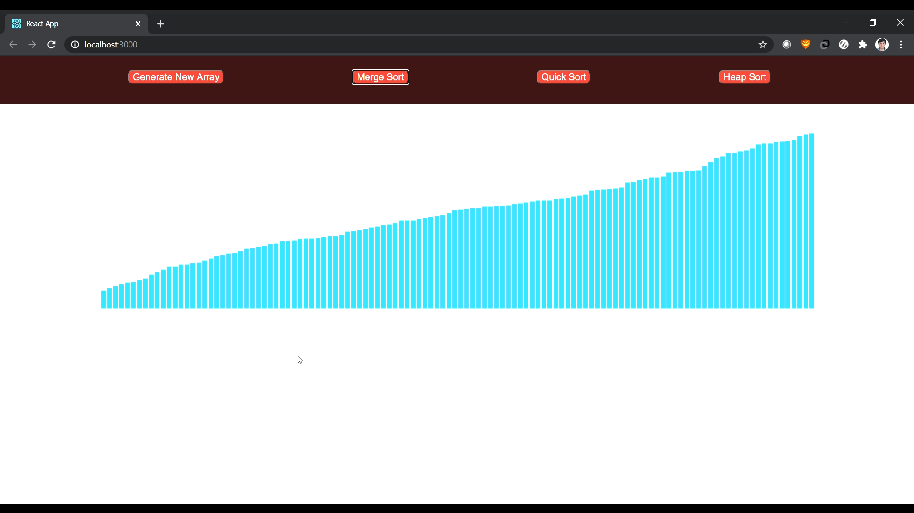

Created an application that visualizes the following sorting algorithms:

1.  Quick Sort
2.  Merge Sort
3.  Heap Sort

Following are some example screenshots:

To start this project:

1.  cd to my-app
2.  npm install
3.  npm start

Got the inspiration for this project from https://github.com/clementmihailescu
